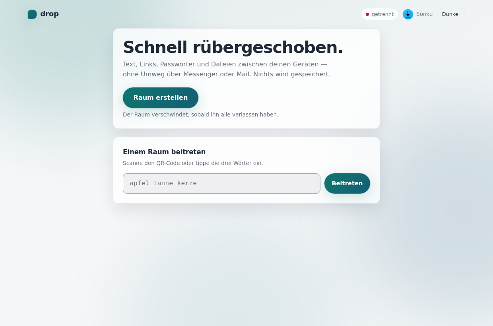
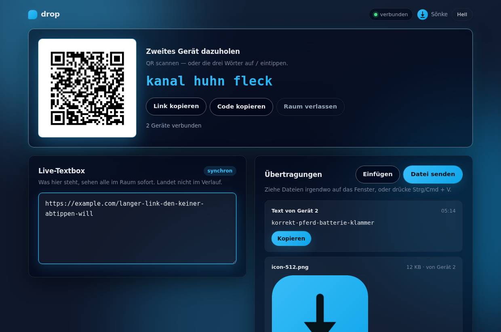

# drop

drop ist deine schnelle Ablage zwischen Geräten: ein Ort, um Text, Links,
Passwörter und Dateien vom Rechner aufs Handy zu schieben und zurück, ohne
Umweg über Messenger, Mail oder Cloud-Speicher. Kein Konto fürs Gegenüber,
kein Verlauf, nichts wird gespeichert — sobald der letzte Teilnehmer geht,
ist der Raum weg.

Kurz gesagt: kein Sich-selbst-eine-Mail-schreiben mehr, kein Screenshot in
drei Messengern verteilt, sondern ein Link oder drei Wörter, und die Datei
ist drüben.



## Was drop für dich macht

- **Räume in Sekunden öffnen** – anmelden, „Raum erstellen“, fertig.
- **Ohne Login beitreten** – ein QR-Code oder drei deutsche Wörter reichen
  dem zweiten Gerät.
- **Live mittippen** – eine gemeinsame Textbox, in der alle sofort sehen,
  was reinkommt. Ideal für einen Link oder ein Einmalpasswort.
- **Dateien durchreichen** – Datei-Button, Drag&Drop oder einfach
  Strg/Cmd+V für einen Screenshot.
- **Bei Empfang gleich weiterverwenden** – Text kopieren, Bilder kopieren
  oder herunterladen, alles andere herunterladen.
- **Als App installieren** – drop ist eine PWA und lässt sich auf dem
  Homescreen ablegen.
- **Auf Englisch oder Deutsch** – die Oberfläche erkennt automatisch die
  Sprache des Browsers.

## Für wen ist das?

drop passt zu dir, wenn du ...

- ständig Links oder Passwörter zwischen Rechner und Handy hin- und
  herschickst,
- Screenshots nicht extra an dich selbst mailen willst,
- kurz jemandem ohne Account eine Datei zuschieben musst,
- selbst hostest und wissen willst, wo deine Daten liegen — hier: nirgends, denn es
  wird nichts gespeichert.

## Schnellstart mit Docker

```bash
cp .env.example .env
```

Trag mindestens `DROP_PUBLIC_URL`, `DROP_OIDC_ISSUER`, `DROP_OIDC_CLIENT_ID`
und einen `DROP_SESSION_KEY` ein (siehe unten, „Login per OIDC“).

```yaml
services:
  drop:
    build: https://github.com/doenke/drop.git#main
    image: drop-drop:latest
    container_name: drop
    restart: unless-stopped
    env_file: .env
    ports:
      - "8080:8080"
```
Ein Volume ist absichtlich nicht dabei — drop persistiert nichts.

Danach öffnest du `http://localhost:8080`. Ein Raum lässt sich erst nach
dem Login erstellen — Beitreten per Code funktioniert immer, ganz ohne
Konto.

## Ein erster Rundgang

### 1. Raum erstellen

Anmelden, „Raum erstellen“ klicken — fertig. drop vergibt einen langen
Zufallstoken für den QR-Code und einen kurzen 3-Wörter-Code als
tippbaren Fallback.

### 2. Zweites Gerät dazuholen

QR-Code scannen oder die drei Wörter eintippen. Kein Konto nötig, kein
zusätzlicher Schritt — der Link führt direkt in den Raum.



### 3. Live tippen oder senden

Die Live-Textbox ist für schnelle Links und Passwörter gedacht — einer
tippt, alle sehen es sofort, und es landet nicht im Verlauf. Für Dateien
und größere Text-Snippets gibt es den Transfer-Feed: Datei-Button,
Drag&Drop oder Einfügen per Strg/Cmd+V.

### 4. Empfangen und weiterverwenden

Jedes Item im Feed hat passende Aktionen: Text kopieren, Bilder kopieren
oder herunterladen, alle anderen Dateien herunterladen. Sobald der letzte
Teilnehmer den Raum verlässt, ist alles weg.

## Login per OIDC

drop meldet Ersteller über OIDC an (Authorization Code + PKCE), zum
Beispiel gegen [Pocket ID](https://github.com/pocket-id/pocket-id). Dafür
brauchst du:

- `DROP_OIDC_ISSUER`
- `DROP_OIDC_CLIENT_ID`

`DROP_OIDC_CLIENT_SECRET` bleibt bei einem öffentlichen Client leer. Beim
Provider als Redirect-URI genau `${DROP_PUBLIC_URL}/auth/callback`
eintragen.

Beitreten per QR-Code oder 3-Wörter-Code braucht **kein** Konto — das ist
für das zweite Gerät gedacht, das nur kurz mitmachen soll.

## Kleine Konfiguration, großer Nutzen

Für den normalen Betrieb brauchst du nur wenige Werte:

| Einstellung | Wofür? |
| --- | --- |
| `DROP_PUBLIC_URL` | Pflicht. Öffentliche Adresse, aus der Redirect-URI, Raum-Links und der erlaubte WebSocket-Origin gebildet werden. |
| `DROP_OIDC_ISSUER` / `DROP_OIDC_CLIENT_ID` | Pflicht. Der Identity-Provider für den Login der Raum-Ersteller. |
| `DROP_SESSION_KEY` | Schlüssel für das signierte Session-Cookie. Fehlt er, erzeugt drop beim Start einen — dann sind nach jedem Neustart alle Anmeldungen weg. |
| `DROP_TRUSTED_PROXY` | `true`, wenn ein Reverse Proxy davor steht und `X-Forwarded-For` die echte Client-IP trägt. |
| `DROP_TITLE` | Name der Instanz in Tab, Kopfzeile, installierter PWA und Footer. Vorgabe: `drop`. |
| `DROP_HEADER_LOGO_URL` | Eigenes Logo ganz links in der Kopfzeile, vor dem drop-Icon. Vorgabe: kein Logo. |

Alle Werte inklusive Transfer-Limits, Raum-Lebensdauer und Rate-Limit
stehen ausführlich kommentiert in [.env.example](.env.example).

---

## Technikraum

Die vollständig kommentierte Compose Vorlage liegt unter [compose.example.yml](compose.example.yml).

### Reverse Proxy (z. B. Nginx Proxy Manager)

Proxy Host auf den Container, dazu:

- **Websockets Support** aktivieren — ohne das kommt keine Verbindung
  zustande.
- **Force SSL** aktivieren, damit das Session-Cookie mit `Secure`
  zurückkommt.
- `DROP_TRUSTED_PROXY=true` setzen, damit das Rate-Limit die echte
  Client-IP aus `X-Forwarded-For` benutzt statt der Proxy-Adresse.

Der Server pingt alle 25 Sekunden, damit ein Proxy stille Verbindungen
nicht kappt.

### Wichtige Hinweise zum Betrieb

- `DROP_SESSION_KEY` sollte gesetzt sein und mindestens 16 Zeichen lang
  sein, sonst erzeugt drop beim Start einen zufälligen Schlüssel und alle
  Sessions gehen bei jedem Neustart verloren.
- Räume gelten nur für den einzelnen Container — drop hält seinen
  Zustand ausschließlich im Prozessspeicher und ist nicht für mehrere
  Replicas hinter demselben Balancer ausgelegt.
- Der 3-Wörter-Code hat bewusst wenig Entropie; `DROP_JOIN_RATE_PER_MINUTE`
  und `DROP_JOIN_RATE_BURST` begrenzen Durchprobier-Versuche pro IP.
- `DROP_AVATAR_HOSTS` ist der SSRF-Schutz des Profilbild-Proxys — je
  kürzer die Liste, desto besser.


## Lizenz

[MIT](LICENSE)
